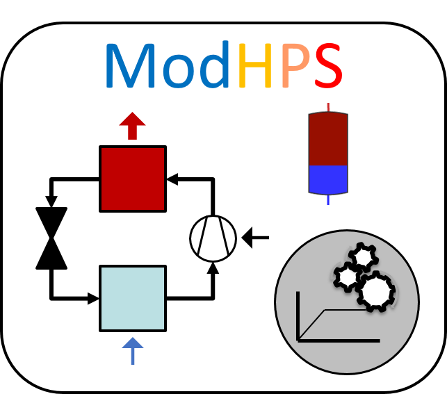

# ModHPS

**Mod**el for **H**eat **P**ump **S**ystems (**ModHPS**) is a simplified black-box brine-to-water heat pump system model with the application range from single buildings up to district level. The model contains simplified algorithms for thermal storage balances and control strategies. ModHPS has been developed in the programming language C++ and can be coupled bidirectional to subsurface models. ModHPS is intended to be used especially in early planning and decision making phases where the detailed modeling of dynamics within the heat pump components is not crucial.

## Quick start

Optional: Change input-data in XML (folder 'ModHPS/import').

Compile: Open folder 'ModHPS/src' in terminal and type:
```
g++ -std=c++11 -o ../ModHPS *.cpp

```

Run executable ModHPS: 
Open folder 'ModHPS/run' in terminal and type:
```
../ModHPS
```

Results in folder 'ModHPS/run/hpm'. 


## Structure of the repository

Under **src** all scripts and necessary files for the functionality of the model are stored. **import** contains the XML-input file. In **run/hpm** all results are stored. **doc** contains a html documentation (created with doxygen).

## Documentation

Open folder 'ModHPS/src' in terminal and type:
```
doxygen configFileDoxygen
```
Open folder 'doc/html' and open a html file.


## Citation

The following publication has to be cited for the use of the code.
```bibtex
@article{WECKPONTEN2022102579,
title = {Simplified heat pump system model integrated in a tool chain for digitally and simulation-based planning shallow geothermal systems},
journal = {Geothermics},
volume = {106},
pages = {102579},
year = {2022},
issn = {0375-6505},
doi = {https://doi.org/10.1016/j.geothermics.2022.102579},
url = {https://www.sciencedirect.com/science/article/pii/S0375650522002255},
author = {Sebastian Weck-Ponten and Jérôme Frisch and Christoph {van Treeck}},
keywords = {Heat pump model, Tool chain, Planning shallow geothermal systems, Early planning phase, Geothermal energy},
abstract = {In planning tools for shallow geothermal source systems, the heat pump is often considered in a highly simplified way without any dedicated control behavior or individual system setup. In this article, a simplified black-box heat pump system model for individual buildings up to city districts is presented that can be coupled to subsurface models. The model contains simplified algorithms for thermal storage balances and control strategies and is integrated into a tool chain for planning shallow geothermal systems in the early planning phase. The source code of the presented heat pump model is provided open-source according to the MIT license.}

@phdthesis{weckPonten2023simulationsbasiertes,
  title = {Simulationsbasiertes Mehrebenen-Planungswerkzeug f{\"u}r geothermische W{\"a}rmepumpensysteme},
  author = {Weck-Ponten, Sebastian},
  year = {2023},
  school = {{RWTH Aachen University, Lehrstuhl f{\"u}r Energieeffizientes Bauen - E3D}},
  address = {Aachen, Germany},
  month = {September},
  note = {{DOI: 10.18154/RWTH-2023-09082}}
}

@software{ModHPS,
	title        = {ModHPS},
	author       = {Weck-Ponten, Sebastian},
	url          = {https://github.com/RWTH-E3D/ModHPS},
	version      = {1.1},
	date         = {2023-11-13}
}
```

## Licence

The program code is licensed via the [MIT license](LICENSE).

## Author

[Sebastian Weck-Ponten](https://www.e3d.rwth-aachen.de/cms/E3D/Der-Lehrstuhl/Team/Wissenschaftliche-Beschaeftigte/~mfgk/Sebastian-Weck/)

weck@e3d.rwth-aachen.de  
[E3D - Institute of Energy Efficiency and Sustainable Building  ](https://www.e3d.rwth-aachen.de/go/id/iyld/?)     
RWTH Aachen University


